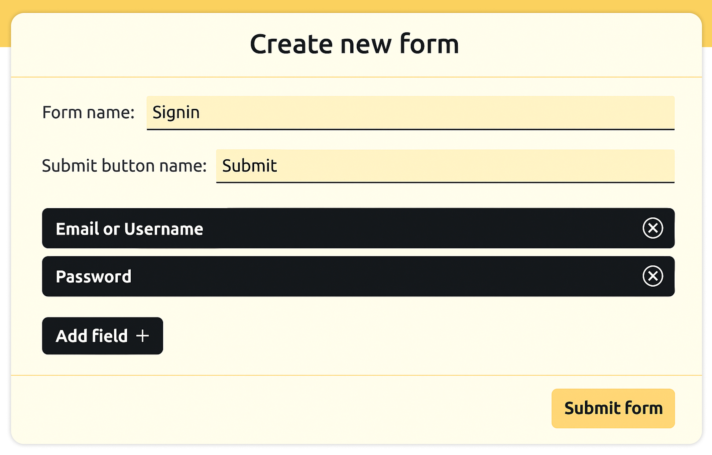

# Create your own Dynamic form

This project was generated with [Angular CLI](https://github.com/angular/angular-cli) version 13.3.0.

## Development server

Run `ng serve` for a dev server. Navigate to `http://localhost:4200/`. The application will automatically reload if you change any of the source files.

## Dynamic form generate API application

API application is developed using Node JS and MongoDB. You can find more information [here](https://github.com/SevenSquare-Tech/generate-dynamic-forms-api-with-validation)

Sample form API response if you don't want to use any backend application then you can use this JSON response directly.

```json
{
  "data": {
    "_id": "632b00838b881013251e2a75",
    "form_name": "Profile",
    "form_key": "CS95y******",
    "status": true,
    "submitButtonName": "Submit",
    "fields_id": [
      {
        "_id": "632b00838b881013251e2a70",
        "field_label": "First Name",
        "field_name": "first_name",
        "field_type": "text",
        "iseditable": true,
        "isvisibletolist": false,
        "is_visible_in_entery": true,
        "field_values": [],
        "validation": {
          "required": true
        }
      },
      {
        "_id": "632b00838b881013251e2a71",
        "field_label": "Last Name",
        "field_name": "last_name",
        "field_type": "text",
        "iseditable": true,
        "isvisibletolist": false,
        "is_visible_in_entery": true,
        "field_values": [],
        "validation": {
          "required": true
        }
      },
      {
        "_id": "632b00838b881013251e2a72",
        "field_label": "Email",
        "field_name": "email",
        "field_type": "email",
        "iseditable": true,
        "isvisibletolist": false,
        "is_visible_in_entery": true,
        "field_values": [],
        "validation": {
          "required": true
        }
      },
      {
        "_id": "632b00838b881013251e2a73",
        "field_label": "Gender",
        "field_name": "gender",
        "field_type": "radio",
        "iseditable": true,
        "isvisibletolist": false,
        "is_visible_in_entery": true,
        "field_values": [
          {
            "value_name": "male",
            "value_text": "Male"
          },
          {
            "value_name": "female",
            "value_text": "Female"
          }
        ]
      }
    ]
  }
}
```

## How to create dynamic forms

- Create a new admin user to generate, view and edit forms:


- After that Login with that user.

- Click on **Create new form** from the navigation bar on a top right side.


- Add form name and name of the submit button for your form.


- Click on Add field button to add a new field for that form with validations.


- Once all require fields are added for that form then click on submit form to create a new form.



- Your form is generated


- You can update the form field type, label and validations and you can also add a new field for that form.


